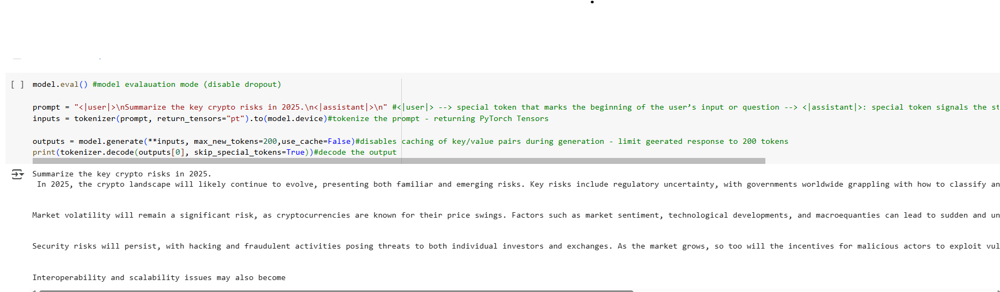

# Fine-Tuning Phi-3 Mini with LoRA on a Crypto Compliance Report

## Project Overview
- This project demonstrates how to fine-tune the microsoft/phi-3-mini-4k-instruct Large Language Model (LLM) using LoRA (Low-Rank Adaptation) for domain adaptation. We inject new knowledge into the model using a PDF report on cryptocurrency compliance in 2025. The model is then able to answer questions based on the newly learned context — without full model retraining.

- Designed to work entirely in Google Colab using 4-bit quantization, this project is resource-efficient and perfect for extending open-source LLMs with domain-specific updates.

## Technologies & Tools
- Component	Tool/Library
- LLM	microsoft/phi-3-mini-4k-instruct
- Fine-tuning	PEFT (LoRA)
- Quantization	bitsandbytes (4-bit inference)
- Tokenization	Hugging Face transformers
- Dataset creation	Hugging Face datasets
- Training	Trainer from transformers
- PDF parsing PyPDF2 
- Runtime	Google Colab (CUDA)

## Highlights
- Efficient LoRA fine-tuning on a quantized LLM
- Domain adaptation from an unstructured PDF
- Lightweight Colab-compatible workflow
- Real-world enterprise NLP use case

## Key Takeaways from the LoRA Fine-Tuning Project on Phi-3
### Document Processing Pipeline
- You start by extracting raw text from PDF files (using PyPDF2) and chunking the long text into manageable parts based on tokenizer tokens with overlapping windows. This ensures the model can handle long documents without losing context.

### Dataset Preparation
- The chunked text data is converted into a Hugging Face Dataset to streamline tokenization and batching, enabling efficient data handling during training.

### Tokenization with Padding
- Setting tokenizer.pad_token = tokenizer.eos_token is crucial for models without an explicit padding token, avoiding padding-related errors during batch processing.

### Model Loading & Quantization
- The Phi-3 model is loaded in 4-bit precision (load_in_4bit=True), significantly reducing memory and compute needs, making training on consumer GPUs more feasible.

### LoRA Adapter Setup
- LoRA configuration targets specific modules (qkv_proj) within Phi-3 to inject low-rank adapters, enabling parameter-efficient fine-tuning that requires updating only a fraction of model weights.
- 
### Tokenization Function for Training
- The tokenization function truncates and pads inputs, and copies input IDs to labels, preparing data for causal language modeling.

### Training Configuration
- TrainingArguments define the training loop’s behavior (batch size, epochs, fp16 mixed precision, saving and logging frequency), and Trainer handles the training loop and model updates.

### Integration with Logging Tools
- You may encounter prompts to configure Weights & Biases (wandb) for experiment tracking, which helps monitor metrics and progress during fine-tuning but I diabled this using ***reports_to=[]*** in TrainingArugments

### Inference with Contextual Prompts
- At inference, you use prompt templates with special tokens (<|user|>, <|assistant|>) that help Phi-3 understand conversational context and generate coherent answers.

### Error Handling & Debugging
- Common issues arise from missing pad tokens, sequence length limits, or misconfigured target modules. Solutions include setting pad_token, chunking inputs, and correctly specifying LoRA target_modules.

### Resource Efficiency
- Combining LoRA with quantization enables fine-tuning large language models on limited hardware without compromising too much on performance.

### Modular & Extensible Code
- Each step (data prep, tokenization, LoRA setup, training, inference) is modular, allowing easy adaptation to other datasets or models.

## Model Output
- Using LoRA in this project demonstrated an excellent approach to fine-tuning a model without updating all its parameters. It highlights how adaptable LoRA is within the world of large language models—offering both cost efficiency and memory efficiency—while still delivering outstanding results

